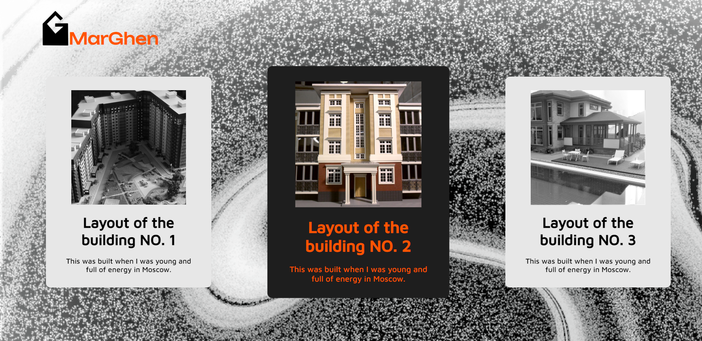

# MarGhen Desktop Layout project


## Welcome! 
Thank you for checking out my project!

- [The challenge](#the-challenge)
- [Built with](#built-with)
- [What I learned](#what-i-learned)
- [Continued development](#continued-development)
- [Author](#author)


## The challenge: 
The challenge was to create a landing page with 3 cards presenting the projects of the author. 
The users should be able to:
 
 See hover states for interactive elements.

### Built with

- Semantic HTML5 markup
- CSS custom properties
- Flexbox

### What I learned

```css
.one:hover {
  transform: scale(1.1);
}
```

```css
.one {
    filter: grayscale (100%);
}

```

```css
.example {
transition: transform linear 0.4s, opacity linear 0.4s;
    cursor: pointer;
}
```

### Continued development
In the future a nav bar can be added which will help the users to navigate the website for more information. Also an album with a bigger range of pictures can be provided for every project so that the customers can view the project from different angles.

## Author
-LinkedIn [Cristina Baiu (FineLine0)](https://www.linkedin.com/in/cristinabaiu01/)
-GitHub [Cristina Baiu (FineLine0)](https://github.com/FineLine01)